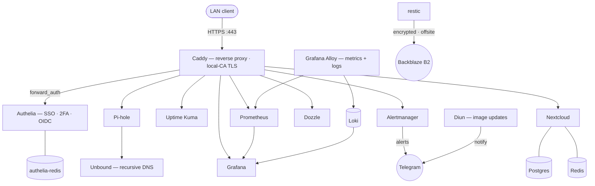

# Homelab

Personal homelab built with Docker Compose - a hands-on environment for learning
self-hosting, networking, and DevOps practices (reverse proxies, secrets, monitoring,
and - next - orchestration).

Each service is an independent Docker Compose stack, version-controlled and
migration-ready: move the whole setup to another machine by cloning this repo,
decrypting the SOPS secrets bundle with your age key, recreating the shared
network, and copying data folders.

> Configs live here (public); the runbooks, gotchas and design decisions are kept
> in a separate **private** `homelab-docs` repo.

## Architecture


A LAN client reaches everything through **Caddy** over HTTPS (built-in local CA). Caddy gates the
admin UIs (Pi-hole, Uptime Kuma, Prometheus, Alertmanager, Dozzle) through **Authelia** via
`forward_auth`, and hands **Nextcloud** and **Grafana** their logins via **Authelia OIDC**.
Databases and caches sit on segmented internal networks with no host ports.

## Structure
- One folder per service, each with its own `docker-compose.yml`
- `ansible/` + root `Makefile` — IaC that installs Docker, renders secrets, creates the
  `proxy` net and deploys every stack (`make bootstrap`); turns a new-host bring-up into one command
- Persistent data in `./<service>/data/` (or `./pihole/etc-pihole/`) - gitignored, copied on migration
- Secrets as files in `./<service>/secrets/` - gitignored, recreated on migration
- TLS: Caddy's **local CA + issued certs** live in `./caddy/data/` - gitignored; the CA is
  per-machine (trust it once per device), certs are auto-issued, nothing to regenerate by hand

## Conventions
- **Pinned exact image versions** (e.g. `caddy:2.11.4`, not `:2` or `:latest`) so updates are deliberate
- **`restart: unless-stopped`** on every service (survives reboots)
- **Bind-mounted data** inside each service folder (portable)
- **Container hardening** - `security_opt: [no-new-privileges:true]`, `cap_drop: [ALL]`
  (+ a curated `cap_add` only where an image needs it), and a `pids_limit` on every service;
  `read_only: true` + `tmpfs` on the stateless ones. Two documented exceptions: **alloy**
  (needs host access, no `cap_drop`) and **authelia** (writes at startup, no `read_only`)
- **Bounded logs** - `json-file` driver with `max-size: 10m`, `max-file: 3` on every
  service, so container logs can't silently fill the disk on an always-on host
- **Resource limits** - `deploy.resources.limits` (CPU + memory) per service, plus
  memory `reservations`; enforced by plain `docker compose` (not only Swarm). Keeps one
  runaway container (e.g. a Pi-hole gravity rebuild) from starving the host
- **Docker secrets** for credentials - files under `./<service>/secrets/`, mounted at
  `/run/secrets/*` (Pi-hole web password, Diun Telegram token/chat-id). Never committed.
- **Shared `proxy` network** (external) - Caddy routes to every web service over it, by
  container name
- **HTTPS everywhere** - Caddy serves TLS on `:443` using its **built-in local CA**
  (automatic HTTP→HTTPS redirect) and applies a shared `secure_headers` snippet (HSTS,
  X-Frame-Options, content-type-nosniff, referrer-policy). Web services are declared as
  **site blocks in `caddy/Caddyfile`** - no per-container proxy labels.
- **Backups (disabled by default)** - a `backup/` stack (restic via resticker) pushes
  encrypted, deduplicated snapshots of the stateful bind-mounts to Backblaze B2. It sits
  behind a Compose `profile`, so it starts *only* with `--profile backup up -d` - intended
  for the always-on server, not the dev laptop. Both credentials are Docker secrets (repo
  passphrase + an `rclone.conf` holding the B2 key). See the runbook in `homelab-docs`.
- **Git as source of truth** for configuration
- **Validated in CI** (`.github/workflows/validate.yml`) - yamllint, `docker compose config`,
  promtool/amtool/`caddy validate`, and a SOPS-encrypted guard; plus a **Trivy** CVE scan of every
  pinned image (`make scan` / weekly). Diun flags *newer* tags; Trivy flags a *known hole in the
  current pin*. Run the same checks locally with `make validate`

## Services
| Service     | Purpose                         | Access                              |
|-------------|---------------------------------|-------------------------------------|
| Caddy       | Reverse proxy + local TLS       | internal (`:80`/`:443`, no dashboard) |
| Authelia    | SSO + 2FA (forward_auth + OIDC) | `https://auth.home.lan`             |
| Uptime Kuma | Uptime / status monitoring      | `https://kuma.home.lan` (SSO)       |
| Pi-hole     | Network-wide DNS ad-blocking    | `https://pihole.home.lan/admin/` (SSO) + DNS `:53` |
| Unbound     | Recursive DNS resolver          | internal only (`:5335`)             |
| Diun        | Image-update notifier (Telegram)| internal (no web UI)                |
| Nextcloud   | File sync/share (app+DB+cache)  | `https://nextcloud.home`            |
| Postgres    | Nextcloud database              | internal `internal` net (no host port) |
| Redis       | Nextcloud cache + file locking  | internal `internal` net (no host port) |
| Backup      | restic → Backblaze B2 (offsite) | internal — **disabled by default**  |
| Prometheus  | Metrics TSDB + scraper + alerts | `https://prometheus.home.lan` (SSO) |
| Grafana Alloy | Unified collector (metrics+logs) | internal (`monitoring` net)         |
| Loki        | Log store (filesystem, 30d)     | internal (`monitoring` net)         |
| Grafana     | Dashboards (provisioned as code)| `https://grafana.home.lan` (OIDC)   |
| Alertmanager| Alert routing → Telegram        | `https://alertmanager.home.lan` (SSO) |
| Blackbox    | TLS-cert-expiry + endpoint probes | internal (`monitoring` net)       |
| Dozzle      | Live container-log viewer       | `https://dozzle.home.lan` (SSO)     |

Local `*.home` names resolve via `/etc/hosts` entries pointing at this machine.

## First-run / bootstrap
**One command** — the whole thing is codified as Ansible (`ansible/`, wrapped by a `Makefile`):
```bash
make deps          # install the Ansible collections
make bootstrap     # install Docker + render secrets + create proxy net + bring stacks up
```
It installs Docker (pacman on Arch / apt on Debian), decrypts the SOPS bundle into the
per-service `secrets/` files, creates the external `proxy` network, and deploys every stack.
The only prerequisite is your age private key at `~/.config/sops/age/keys.txt` (out-of-band,
never in git). See `architecture/ansible.md` in the private docs.

<details><summary>Or, by hand (what the playbook automates)</summary>

Needs `sops`, `age`, `jq`, and your age private key at `~/.config/sops/age/keys.txt`.
```bash
# 1. shared reverse-proxy network (external; all stacks attach to it)
docker network create proxy

# 2. secrets - decrypt the committed per-service SOPS bundles into the secrets/ files,
#    byte-exact with the right mode (see the "Secrets" section for the why):
for b in */secrets.sops.yaml; do
  sops -d --output-type json "$b" \
    | jq -r '.secrets[] | .path + "\t" + .mode + "\t" + .data' \
    | while IFS=$'\t' read -r p m d; do
        mkdir -p "$(dirname "$p")"; printf '%s' "$d" | base64 -d > "$p"; chmod "$m" "$p"
      done
done

# 3. enable the repo's git hooks (blocks committing plaintext secrets / age keys)
git config core.hooksPath .githooks

# 4. local hostnames (LAN-only names resolve via /etc/hosts on this machine)
echo "127.0.0.1 auth.home.lan kuma.home pihole.home nextcloud.home \
grafana.home.lan prometheus.home.lan alertmanager.home.lan dozzle.home.lan" | sudo tee -a /etc/hosts

# 5. bring up the core stacks (order-independent; proxy net is external).
#    monitoring has extra prep - see its section below.
for s in caddy authelia pihole uptime-kuma diun nextcloud; do
  docker compose -f "$s/docker-compose.yml" up -d
done

# 6. TLS: trust Caddy's local CA once per device (replaces mkcert)
docker cp caddy:/data/caddy/pki/authorities/local/root.crt /tmp/caddy-root.crt
sudo cp /tmp/caddy-root.crt /etc/ca-certificates/trust-source/anchors/caddy-root.crt
sudo trust extract-compat                              # then restart browsers
```
</details>

### Adding a new web service
Add a site block to `caddy/Caddyfile`:
```caddyfile
NAME.home {
    tls internal
    import secure_headers
    reverse_proxy CONTAINER:PORT
}
```
then add `NAME.home` to `/etc/hosts` and `docker compose -f caddy/docker-compose.yml up -d`.
Caddy issues the cert automatically on first request - no cert-regeneration step.

### Backups (optional - server only, disabled by default)
The `backup/` stack is **not** started by the loop above (it's behind a Compose
`profile`), and it's meant for the always-on host, not the laptop. To enable it there:
Its restic passphrase + `rclone.conf` are already in the SOPS bundle (rendered in step 2).
```bash
# set the bucket in backup/docker-compose.yml (RESTIC_REPOSITORY), then INIT ONCE
# (single container - avoids the first-init race) before starting the scheduled jobs:
docker compose -f backup/docker-compose.yml run --rm backup backup /data --tag homelab --exclude-caches
docker compose -f backup/docker-compose.yml --profile backup up -d
```
Disable again with `docker compose -f backup/docker-compose.yml --profile backup down`.
Full write-up (3-2-1 strategy, restore/break-glass, gotchas) in the private `homelab-docs`
repo (`backup/backups.md`).

### Monitoring (metrics + logs)
The `monitoring/` stack is Prometheus + **Grafana Alloy** (one unified collector for host
+ container **metrics → Prometheus** and container **logs → Loki**, replacing separate
node-exporter + cAdvisor) + **Loki** (log store) + Grafana (SSO via Authelia OIDC) +
Alertmanager (→ Telegram) + Dozzle (live logs). Bootstrap:
```bash
cd monitoring     # data in named volumes; secrets (grafana admin/oidc, alertmanager telegram) come from the SOPS bundle (step 2)
# CA bundle so Grafana trusts Caddy's local CA for the OIDC back-channel (Caddy must be up):
mkdir -p grafana/certs && docker run --rm --entrypoint cat grafana/grafana:13.2.2 /etc/ssl/certs/ca-certificates.crt > grafana/certs/ca-bundle.crt
docker cp caddy:/data/caddy/pki/authorities/local/root.crt /tmp/caddy-root.crt && cat /tmp/caddy-root.crt >> grafana/certs/ca-bundle.crt
echo "127.0.0.1 grafana.home.lan prometheus.home.lan alertmanager.home.lan dozzle.home.lan" | sudo tee -a /etc/hosts
docker compose -f ../authelia/docker-compose.yml up -d          # picks up the new grafana OIDC client
docker compose -f ../caddy/docker-compose.yml up -d && docker exec caddy caddy reload --config /etc/caddy/Caddyfile
docker compose up -d
```
Grafana keeps a break-glass local `admin`; put yourself in an `admins` group in
`authelia/config/users_database.yml` for Grafana Admin. Full runbook (why Alloy, OIDC
back-channel, alert rules, dashboards-as-code, gotchas) in `homelab-docs/monitoring/monitoring.md`.

## Secrets (SOPS + age)
Every credential is committed to this **public** repo - safely - with
[SOPS](https://github.com/getsops/sops) + [age](https://github.com/FiloSottile/age). Secrets live in
**per-service** encrypted files, `<service>/secrets.sops.yaml` (authelia/backup/diun/monitoring/
nextcloud); only the **values** are encrypted (each `path` and `mode` stays cleartext, so `git diff`
shows *which* secret changed, never the value). Per-file (vs one bundle) is the GitOps-idiomatic
layout and lets a new service's secrets be added from a machine that has only the **public** keys
(`sops encrypt` a new file needs no private key).

- **One private key decrypts everything** - `~/.config/sops/age/keys.txt`, kept out-of-band
  (password manager), never in git. A second **backup recipient** key sits in offline cold storage
  so a lost primary isn't fatal - `.sops.yaml` lists both public keys as recipients.
- **Deploy = decrypt to files.** Values are base64 of each secret's exact bytes; the render step in
  [bootstrap](#first-run--bootstrap) recreates every `*/secrets/<name>` file byte-exact with the
  right mode, and Compose bind-mounts them at `/run/secrets/*` as before.
- **Rotate / re-key:** edit a value and re-encrypt that service's file, or add/remove recipients in
  `.sops.yaml` then `sops updatekeys <service>/secrets.sops.yaml` for each.
- **Guard rail:** a tracked pre-commit hook (`.githooks/pre-commit`, enabled via
  `git config core.hooksPath .githooks`) blocks committing an unencrypted `secrets.sops.yaml`, an
  age private key, or any plaintext `secrets/` file.

> Plaintext secret files still exist on the host at runtime (mode 600/644, gitignored). SOPS
> encrypts the **git + backup** copy, not on-disk exposure - that's inherent to Docker
> file-secrets, and no worse than before. Base64 values are chosen for byte-fidelity (trailing
> newlines, modes, binary keys) over hand-editability.

## Machines
- **(dev)** Arch Linux laptop - current build machine (single-host "learning mode":
  `.home` names resolve via `/etc/hosts`; Pi-hole is not the LAN's DNS yet)
- **(planned)** always-on mini PC - future 24/7 host. Intended shape: **Proxmox** host →
  a Debian VM → Docker Engine → these Compose stacks (VM over LXC for kernel isolation
  and clean upgrades). The stack is built to move as-is; see the migration guide in the
  private `homelab-docs` repo (`architecture/migration-proxmox.md`).
